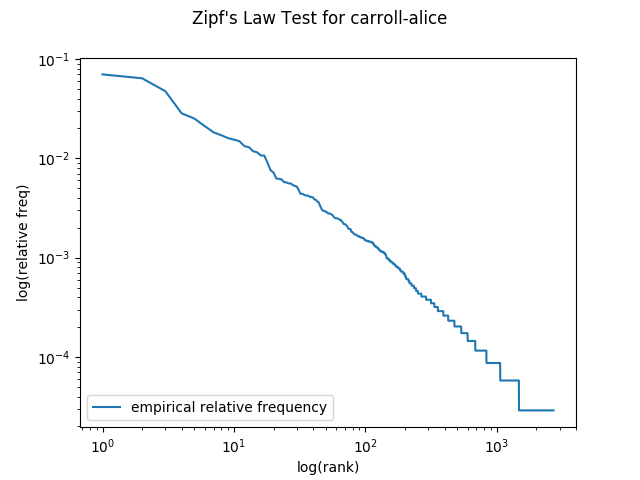

## Overview
This lab has the following starter files:

* `analysis.md`
* `ngrams.py`
* `zipf.py`

You should also plan to create and submit a `pdf` version of your analysis, `analysis.pdf`. 

## SpaCy

This week, we'll get to use the [`spaCy`](https://spacy.io/api/)
python library for the first time. SpaCy is designed to make it easy
to use pre-trained models to analyze very large sets of data. At the
beginning of the semester, we'll be using spaCy as a skeleton for
building our own NLP algorithms.

---


## Zipf's law

In this part of the lab, we will test Zipf's law by using [`matplotlib`](https://matplotlib.org/), a 2D plotting library. Put your code for this part in `zipf.py`.

We are going to explore the relationship between the frequency of a token and the *rank* of that token. If you count all the tokens in `carroll-alice.txt` -- like we did last week -- we would say that `the` has rank of 1, `and` has rank of 2, `to` has a rank of 3, and so on, since this is the order that they appeared when we listed the tokens from most frequent to least frequent. We will use `matplotlib` to compare plot each token's rank against its relative frequency. 

### Part 1(a)

Instead of tokenizing by hand, we will use `spaCy` to do the tokenization. Pause now and read about [space language processing pipelines](https://spacy.io/usage/processing-pipelines). 

For this part, we only want spaCy to tokenize our text, so we will set the `pipeline` to `[]`. Since some of our documents will be long, but since we're not doing any memory-intensive processing, we will tell `spaCy` that it's okay to load large documents all at once instead of a little bit at a time. To specify these instructions, add these lines to the top of your `zipf.py` file: 

```
from spaCy.lang.en import English

nlp = English(pipeline=[], max_length=5000000)
```

Next, write a function called `read_one(file_path)` that takes the location of a file as its input, and that returns a `Counter` object representing all of the *lowercased* tokens in the corresponding text file. 

*Hint*: You can get the **Token** objects in a spaCy document by iterating over a spaCy Doc object, e.g., by using Python's `for...in` loop syntax. You can get the text of a Token (as a string) using the `.text` attribute of the `Token` object. 

*Hint*: The following is a standard Python way to open a latin1-encoded file with name `filename` as read-only (`'r'`). This is a nice alternative to having to call both open and close on a file.

```
with open(filename, 'r', encoding='latin1') as fp: 
    # do processing...
```

Next, write a function called `read_all(dir_path, extension=None)` that takes the location of a directory as its input, and returns a `Counter` object representing all of the text of all of the files in the corresponding directory whose extention is `extension`. If `extension` is `None`, then `read_all` should include *every* file in the directory. For example, `read_all({{page.gutloc}}, ".txt"}})` should return a `Counter` that counts all of the tokens in all of the text files in the `{{page.gutloc}}` directory. 

*Hints*: You will want to use the [`os.walk`](https://docs.python.org/3/library/os.html#os.walk) function to recursively search for files in the directory. You can get a file's extension with [os.path.splitext](https://docs.python.org/3/library/os.path.html#os.path.splitext). It may also be helpful to know that two `Counter` objects can be added together to create a new `Counter` object!

### Part 1(b)

Let *f* be the relative frequency of a word (e.g. if `the` occurs 1642 times out 
of 35652 tokens, then its relative frequency is 1642/35652 =
0.04606), and let *r* be the rank of that word. 

To visualize the relationship between rank and frequency, we will
create a [log-log
plot](https://en.wikipedia.org/wiki/Log%E2%80%93log_plot) of *r* (on
the x-axis) versus *f* (on the y-axis). We will use the `pylab`
library, part of `matplotlib`. By default, `matplotlib` will try to open a window to display figures as soon as they're created. That won't work over ssh (unless you're using window forwarding) *or* in Docker, but we can stop `matlab` from trying to open figures in new windows by changing which backend it uses. This needs to be done *before* we import `pylab`: 

```python
import matplotlib
matplotlib.use('Agg')
from matplotlib import pylab
```

You will write a function called `do_zipf_plot` that takes two parameters: 

* A `Counter` object with the counts of words from one or more files. 
* A `string` label that can be used to title the figure. 

The starter code includes two implemented functions that *call* `do_zipf_plot`: 

* `plot_one`, which calls `read_one` and `do_zipf_plot` to generate a visualization of data from one file, and
* `plot_all`, which calls `read_all` and `do_zipf_plot` to generate a visualization of data from an entire directory. 

Your `do_zipf_plot` function should start by creating a figure object: 

```
fig = pylab.figure()
```

It should then use the `Counter` argument to create data in the right form for a call to [`pylab.loglog`](https://matplotlib.org/api/_as_gen/matplotlib.pyplot.loglog.html#matplotlib-pyplot-loglog)

Be sure to label your plot with `xlabel`, `ylabel`, and `suptitle`. Add a `legend` to the lower left of the plot, and then save the resulting figure:

```
pylab.savefig('zipf_{}.png'.format(label))
pylab.close()
```

Before moving on, confirm that calling `plot_one('carroll-alice.txt')` generates a plot that matches: 




### Part 1(c)

Now we can test how well Zipf’s law works. Read [Wikipedia's article on Zipf's law](https://en.wikipedia.org/wiki/Zipf%27s_law). In summary,
Zipf’s law states that \\(f \propto \frac{1}{r}\\), or equivalently that \\(f = \frac{k}{r}\\) for some constant factor \\(k\\), where \\(f\\) is the
absolute frequency of the word and \\(r\\) is the rank of that word. Following Zipf’s law, the 50th most common
word should occur with three times the frequency of the 150th most common word.

Add to your `do_zipf_plot` function so that in addition to plotting the empirical rank vs frequency data, it also plots the expected values using Zipf’s law. For the constant \\(k\\) in the formulation of Zipf’s law above, you should use \\(\frac{T}{H(n)}\\) where \\(T\\) is the number of word *tokens* in the corpus, \\(n\\) is the number of word *types* in the corpus, and \\(H(n)\\) is the \\(n^{th}\\) harmonic number.

*Hint:* The number of *tokens* is the total number of words in the document. The number of *types* is the total number of *unique* words in the corpus. 

*Hint*: [This function borrowed from StackOverflow](https://stackoverflow.com/questions/404346/python-program-to-calculate-harmonic-series) is included in your starter code to compute harmonic numbers:

```python
def H_approx(n):
    """
    Returns an approximate value of n-th harmonic number.
    http://en.wikipedia.org/wiki/Harmonic_number
    """
    # Euler-Mascheroni constant
    gamma = 0.57721566490153286060651209008240243104215933593992
    return gamma + math.log(n) + 0.5/n - 1./(12*n**2) + 1./(120*n**4)
```

To plot a second curve, you will add a second `pylab.loglog(...)` line after you plot the empirical frequency data. Be sure to label each data line so that your lengend will be informative! Note that relative frequency should always be less than \\(1=10^0\\), as it is the fraction of the total tokens.

#### Questions

Answer the following questions in the corresponding parts of `analysis.md`. Be sure to include plots you get for each part. For help including images in PDFs with pandoc, you can consult [the pandoc documentation](https://pandoc.org/MANUAL.html#images). 

1. **Zipf's Law and Alice**: How well does Zipf’s law approximate the empirical data in `carroll-alice.txt`?

2. **Zipf's Law and Other Texts**: Repeat the previous question for a few other texts included in the `{{page.gutloc}}` directory. Are the results consistent? 

3. **Zipf's Law and All Texts**: Repeat the Zipf's law experiment with all of the text from all of the files in `{{page.gutloc}}`.
   2. How many tokens are in this new corpus?
   3. How does this plot compare with the plots from the smaller corpora?

4. **Zipf's Law Discussion**: Does Zipf’s law hold for each of the plots your made? What intuitions have you formed? Does the length of a document have an impact on how well it does or does not follow Zipf's Law? What else do you notice?

5. **Zipf's Law for Random Text**: Generate random text, e.g., using `random.choice("abcdefg... ")`, taking care to include the space character. You will need to `import random` first. Use the string concatenation operator to accumulate characters into a (very) long string. Then tokenize this string, and generate the Zipf plot as before, and compare the plot to the ones you got from "real" English data. What do you make of Zipf's Law in the light of this? (Source: [Exercise 23b](http://www.nltk.org/book/ch02.html#exercises), Bird, Klein and Loper, 2009)

## Ngrams

This week, we learned about the problem of *sparsity*, or how to handle zeros in language modeling. If
you were to train a unigram language model on the *fiction* category
of the Brown corpus and then try to calculate the probability of
generating the *editorial* category, you’d end with a 0 probability
because there are words that occur in the *editorial* category that
don’t appear in the *fiction* category (e.g. "badge").

In this part of the assignment, we'll explore that problem in more
depth. We'll also start working with the dataset that you'll
use for your final project.

You should put your code for this part in `ngrams.py`. Add the same lines to the top of this file for working with `spaCy` that you have in your `zipf.py`. 

### Part 2a: Extracting data from XML files

A sample of the dataset we'll use for your final project
is in `{{page.semevalloc}}`. There's a single XML file that contains
all of the articles we'll look at this week. Each article has a `hyperpartisan` attribute that indicates whether is it an example of *hyperpartisan news*: "true" or "false".

 Eventually, you may want to use a much larger (~3.6G) data file related to this one in your final project. Loading an xml file that big into memory is a recipe for trouble, though, so it's best not to store the whole
 thing in memory at once if we can help it. Fortunately, the [lxml](https://lxml.de/parsing.html) library gives us a way to
iteratively parse through an xml file, dealing with one node at a
time. Here's sample code that opens a file called `myfile.xml` and
call a function called `my_func` on every `article` node:

```python
from lxml import etree

fp = open("myfile.xml", "br")
for event, element in etree.iterparse(fp, tag=("article",)):
    my_func(element)
  	element.clear()
```

The starter code has a generator function called `do_xml_parse()` that uses `lxml.etree` to yield one node at a time. Look at that code and make sure you can explain how each line of it works before you move on.

Write a function called `get_unigrams` that takes as input a spaCy Doc(ument), and returns a list of all of the unigrams in the document. `get_unigrams` should also take an optional argument `do_lower` whose default value is `True`. That argument should determine whether the text of each token is lowercased before returning the unigrams. For all of the analysis in this lab, you *should* lowercase the tokens unless told otherwise. 

Next, write a function called `get_articles(args, attribute, value)` that returns a `Counter`. `get_articles` will use `do_xml_parse` to iterate through all of the articles in `args.articles`. For each article whose attribute `attribute` has the value `value`, it will call `get_unigrams` on the text of the article. For example, `get_articles(args, 'hyperpartisan', 'true')` will call `get_unigrams` once for every article whose `hyperpartisan` attribute is `true`. 

*Hint*: If you have an article element called `article`, you can access all of the text children of that element with `article.itertext()`. 

*Hint*: Some of the articles contain HTML entities that are "escaped", i.e., marked with special characters to avoid interfering with the XML parsing. You can unescape those by importing the `html` module and calling `html.unescape` on the articles' text before creating your `spaCy` docs. 

Stop now and confirm that if you call `get_articles` on the `semeval-sample.xml` file for the case where `hyperpartisan=true`, you get the following counts: 

```
the: 10631
california: 34
zero: 11
```

We are interested in knowing how many of the unigrams in one category of text (e.g., `hyperpartisan='true'`) are not in another category of text (e.g., `hyperpartisan='false'`). Over the course of this assignment, you will explore several ways of grouping the text, so we'll want to carefully organize our code for reusability. In the rest of this writeup, we'll refer to the set of data we generate counts from as the *training set*, and the set of data that we check for zeros using those counts as the *test set*. 

Write a function called `compare(train_counter, test_counter, unique=False)`. The three arguments to `compare` should be: 

* `train_counter`: A `Counter` object representing counts from the training set
* `test_counter`: A `Counter` object representing counts from the test set
* `unique`: A boolean indicating whether to count zeros for tokens (`unique=False`) or types (`unique=True`)

`compare` should return two numers: 

* The count of (tokens/types) in the test set that have a zero count in the training set
* The total number of (tokens/types) in the test set

Confirm that if you call `compare(Counter([1,2,3]), Counter([3,4,4]), unique=True)` you get `(1,2)`, and if you call `compare(Counter([1,2,3]), Counter([3,4,4]), unique=False)` you get `(2,3)`. 

The given code has a function called `do_experiment` that calls `get_articles` twice (once for the training data, once for the test data), and then prints the results from `compare` as a markdown table. Read through that function now and make sure that you understand it, since you will add it it later in the lab. 

#### Questions

1. What percentage of the tokens that appear in the 'hyperartisan (True)' articles
don't appear in the 'neutral (False)' articles?
2. What percentage of tokens that appear in the 'neutral (False)' articles don't
appear in the 'hyperpartisan (True)' articles?
3. What if you look at types instead of tokens?
4. Are you surprised by these results? Why or why not?

### Part 2b: Bigram analysis

What happens when you move to higher order n-gram models like bigrams and trigrams?

Write a function called `get_bigrams` that takes as input a spaCy Document, and returns a list of all of the bigrams in the document.

Write a function called `get_trigrams` that takes as input a spaCy Document, and returns a list of all of the trigrams in the document.

*Hint*: Don't try to manually generate the bigrams and trigrams. Instead, use your `get_unigrams` function along with python's built-in `zip` function! 

Modify your `get_articles` function so that it returns a tuple with 3 items: a Counter of unigrams, a Counter of bigrams, and a Counter of trigrams. Then modify `do_experiment` so that it generates three table rows with statistics for not only unigram zeros, but also bigram and trigram zeros.

#### Questions

Using the table generated by `do_experiment`, share the following percentages and analyses:

1. What percentage of the bigrams (tokens, not types) that appear in
the 'hyperpartisan' articles don't appear in the 'neutral' articles? What percentage of
the bigrams that appear in the 'neutral' articles don't appear in the
'hyperpartisan' articles? Are you surprised by these results? Why or why not?

1. What percentage of the trigrams (tokens, not types) that appear in
the 'hyperpartisan' articles don't appear in the 'neutral' articles? What percentage of
the trigrams that appear in the 'neutral' articles don't appear in the
'hyperpartisan' articles? Are you surprised by these results? Why or why not?

### Part 2c: Train on equal-sized "chunks"

Instead of training on one category of articles and testing on another,
suppose we break each of the categories in half. Then we could train on half of the hyperpartisan articles and half of the neutral articles, and test on the other half. 

In the sample data you used above, each of the articles has an attribute `randomchunk` that assigns it to either chunk `a` or chunk `b`. 
 
You shouldn't need to write much (any!) code here. Instead of calling `do_experiment` on the `hyperpartisan` attribute, you can now call it on the `randomchunk` attribute. 

The results here can help us calibrate our sense of how much of the effect we saw in the last part is actually connected to the labels (instead of just a natural property of having lots of text). This relates to a concept called a *permutation test* from statistics, a convenient way to reason about what a statistically significant result is when you don't have a clear indication of which probability distribution describes the variable you're interested in.

### Questions

3. Try training on randomchunk `a` and testing on randomchunk `b`.. Then train on randomchunk `b` and test on randomchunk `a`. How are your results different from the previous question? Why? Your writeup should include a table of your results, which you can generate with your expanded `do_experiment` function from above. Report percentages, not raw counts. 

Evaluating a system in this way is called *cross-validation*: instead of having a specific "held out" test set, you split your training data into \\(k\\) equal-sized parts. Each piece then has one turn being the test set, while the other pieces are assembled together as the training set. In this case, since you are breaking your data into \\(k=2\\) distinct test sets, you are performing 2-fold cross-validation.
