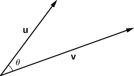
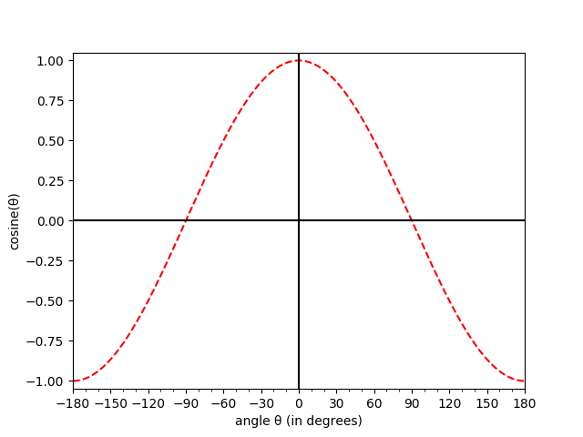
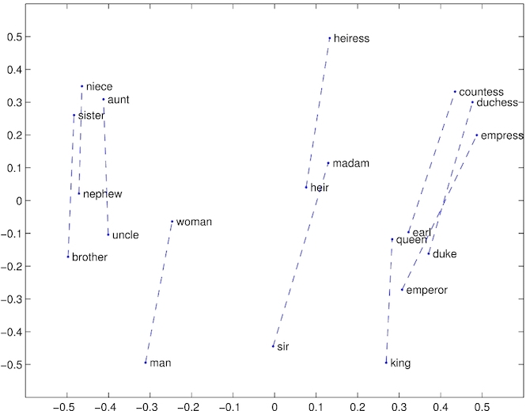
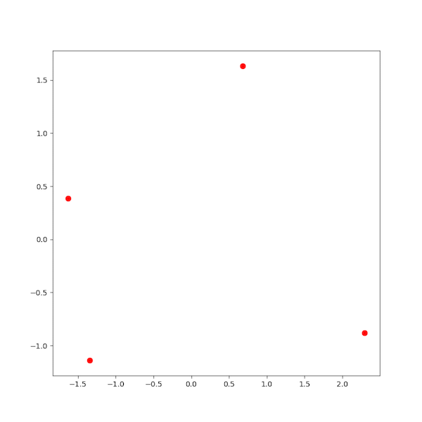
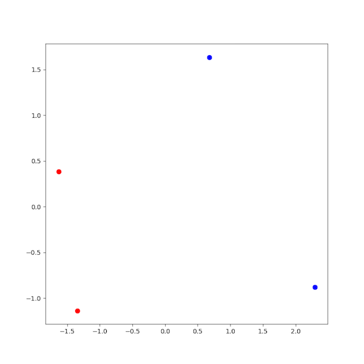
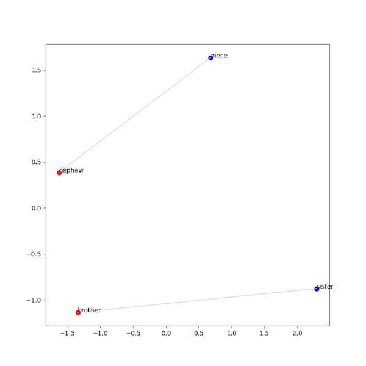
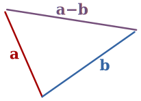

Prior to class, you'll also want to make sure you have the word embeddings downloaded and ready to go. If you're using Docker with a Mac or Linux, after you check out the code repository for Lab 04 but before opening Docker, you should navigate to the directory in  and then run the following script:

```
>>>./download_files.sh
```

which should start the download process for getting all of the word embedding files you need. These are going to take up a few GB, so make sure you have space on disk for them and leave time for them to download.

If you're using Windows, or if the script above doesn't work, you can go ahead and download these files directly to your lab directory by clicking this link (this will start the download). You can then unzip the folder using the command `unzip glove.6B.zip`, which will extract word embeddings that are 50, 100, 200, and 300 dimensions. Finally, you can use the commands `mkdir glove` and `mv glove*.txt glove/` to move the embeddings all into a directory called `glove/`. **Make sure not to add your word embeddings to your repository, as the files are too large to be handled well.**

## Writeup

As you go along, update your `analysis.md` file with answers to question. You should compile your answers into an `analysis.pdf` file to include in your submission. 

## GloVe vectors

"[GloVe](https://nlp.stanford.edu/projects/glove/) (pronounced like the English word "glove") is an unsupervised learning algorithm for obtaining vector representations for words." ([Jeffrey Pennington, Richard Socher, and Christopher D. Manning. 2014. *Global Vectors for Word Representation*](https://nlp.stanford.edu/pubs/glove.pdf))

The GloVe algorithm takes a large text corpus as input and produces multidimensional vectors for every word found in the corpus. The goal of the algorithm is to produce vectors for each word type such that words with semantic similarity (i.e., that are used in similar contexts) will occupy similar parts of the vector space. The vectors output by this algorithm are also called GloVe vectors, GloVe representations, or GloVe word embeddings.

The authors of the algorithm have made the software [available for download](https://nlp.stanford.edu/software/GloVe-1.2.zip) so you can create these vectors yourself. However, in order to achieve high-quality output, the input corpus needs to be very large: on the order of billions or trillions of tokens. At this scale, the file and memory size requirements become prohibitive. A *portion* of one of smallest data sets used by the authors of the paper is a dump of Wikipedia which is over 60GB. While the algorithm is running -- which has been reported to take over 8 hours using a modified parallelized version of the code -- peak memory usage reaches about 12GB, which until recently would exceed the resources of most consumer laptops.

Like many NLP researchers, we are currently less interested in how these algorithms run than what the resulting vectors tell us, so we will use pre-trained vectors that the authors make available on [their website](https://nlp.stanford.edu/projects/glove/).

## Loading and Saving the GloVe vectors

Store the solutions you write for this section (loading and saving the GloVe vectors) in `glove.py`.

### Loading the text vectors into an array

Before you can analyze GloVe vectors, you'll need to write some utilities that can read and write them. An naive to this problem might be to load the vectors from the text file and store each word vector in a dictionary: `d[word] = vector`. The problem with this is that Python stores the resulting data very inefficiently, using much more memory than necessary. When you try to run your code on the largest GloVe vectors, you would almost certainly run out of memory.

Instead you will store the vectors in a [`numpy` array](https://docs.scipy.org/doc/numpy/reference/generated/numpy.array.html).
If this is the first time you are using [`numpy`](https://www.numpy.org/), you should consider pausing the lab for a few minutes to skim through the section called "The Basics" in the `numpy` [Quickstart tutorial](https://docs.scipy.org/doc/numpy/user/quickstart.html), which goes through to the end of subsection entitled "Indexing, Slicing and Iterating".

Using `numpy` will allow you to store the data much more efficiently **and** it will provide a straightforward way for you to save the vectors to a file, allowing you to load them much more quickly than re-parsing the GloVe text file each time. 

After reading in the GloVe text file, we will end up with a `numpy` array where each row of the array is one GloVe vector. A standard Python algorithm to do this would be something like this:

```
create an empty array
for each row in the GloVe file:
   add the row to the end of the array
```

Doing this negates a fair bit of the efficiency gains from using `numpy`. Instead, your algorithm will work as follows:

```
determine the number of rows in the array
determine the number of columns in the array
create an array filled with zeros that has the right number of rows and columns
for each row in the GloVe file:
   fill the appropriate array row with the GloVe file row
```

You'll need to read the GloVe file once through in order to find the rows and columns:
1. Since each vector has the same length, on at least one line you'll need to figure out how long the vector is. This will be the number of columns in your array.
2. You'll need to read each line of the GloVe file and count the lines. The number of lines in the file is the number of rows in your array.

Once you have the number of rows and columns, you can make your `numpy` array:

```python
import numpy   # put at the top of your program
array = numpy.zeros((rows, columns))  # note that the double parenthesis is required
```

Now you'll need to read the file a second time. If you have a file pointer (that is, a pointer to a memory address for a file on your computer) called `fp`, you can reset the pointer to the beginning of the file using `fp.seek(0)`.

For each line in the text file you'll want to:
1. Extract the word and append to the end of a list of words.
1. Extract the vector and turn it into a list of floats.
1. Set `array[i]` equal to the list of floats.

Write a function called `load_text_vectors` that takes a file pointer in mode `'r'` as its only parameter and returns a tuple containing the list of words and the array. You should test this function on the `{{page.dataloc}}/glove.6B.50d.truncated.txt` file in Docker. This file contains only the first 1000 lines of the full 400,000 line `glove.6B.50d.txt` file and so it will run much faster and allow you to debug errors with less frustration. 

Once you're convinced it's working correctly, make sure it works on the `glove.6B.50d.txt` file where you have it downloaded. The rest of the examples in this writeup will be based on that dataset. 

### Saving the text vectors to a `.npy` file

Once your `load_text_vectors` function is working, you'll want to save what you've read to a format that will load more quickly next time. To do this, we'll use the [`numpy.save`](https://docs.scipy.org/doc/numpy/reference/generated/numpy.save.html) function.

When we need the array again, we can just load it quickly from this saved format. Since the array we built above only stores the vectors from the GloVe file and not the words, you'll a way to remember which word was associated with each row of the array. Fortunately, you can also store all of the words in the same file, using the same `numpy.save` function:

```python
with open(filename, 'wb') as fp: # filename should have the extension .npy
    numpy.save(fp, array)            # the numpy array returned by your load_text_vectors function
    numpy.save(fp, words)            # the list of words returned by your load_text_vectors function
```

Write a function called `save_glove_vectors` that takes three parameters: (1) your words and (2) the vectors from `load_text_vectors`, and (3) a writeable file pointer. The function then saves the array and words to the file pointer using `numpy.save`.

### Loading the text vectors from a `.npy` file

You'll want a complementary `load_glove_vectors` function that takes a readable file pointer as its only parameter and loads the vectors and words back from that file, returning a tuple containing the list of words and the array, just like `load_text_vectors`. Here's how to load from a `.npy` file:

```python
with open(filename, 'rb') as fp: 
    array = numpy.load(fp)
    words = list(numpy.load(fp))  # turn back into a regular Python list
```

Be careful to load the values from the `.npy` file in the same order you wrote them out.

### Running from the command line

All of the code you write going forward will expect the input to be a `.npy` file containing the vectors and words. The only program that will read in text files and write out `.npy` files is your `glove.py` program. Use `argparse` so that your `glove.py` program has the following interface:

```
$ python3 utilities.py -h
usage: utilities.py [-h] GloVeFILE npyFILE

positional arguments:
  GloVeFILE   a GloVe text file to read from
  npyFILE     an .npy file to write the saved numpy data to

optional arguments:
  -h, --help  show this help message and exit
```

You can look back at past labs and/or at the [argparse tutorial](https://docs.python.org/3/howto/argparse.html) for help with writing the interface. 

With this interface, you can convert the `{{page.dataloc}}/glove.6B.50d.txt` file into a `.npy` file as follows:

```
$ python3 glove.py {{page.dataloc}}/glove.6B.50d.txt glove.6B.50d.npy
```

Before going to the next section, be sure that you can run the command above with no errors.

## Measuring similarity

Store the solutions you write for this section (computing cosine similarity) to a file called `similarity.py`. You will want to import your code from `glove.py` into this file.

### Calculating the cosine similarity

The GloVe algorithm is designed to produce similar vectors for semantically similar words. We can test how well the GloVe vectors capture semantic similarity with **cosine similarity**. In the figure below ([source](https://math.libretexts.org/TextMaps/Calculus/Book%3A_Calculus_(OpenStax)/12%3A_Vectors_in_Space/12.3%3A_The_Dot_Product)), vectors `u` and `v` are separated by an angle of &theta;:



As you'll recall from the reading, using angles to capture similarity can help us counteract the effects that word frequency may have on the magnitude of our vectors. Two vectors that are separated by a small angle are more similar than two vectors separated by a large angle. Rather than find the actual angle in between the two vectors, we will find the *cosine* of the angle between the two vectors. Notice in the plot below that when the angle between two vectors is 0, the cosine of the angle between the two vectors is 1. As the angle between the two vectors increases, the cosine of the angle decreases. When the two vectors are as far apart as possible (180 degrees rotated from one another), the cosine of the angle between them is -1.



In order to compute the angle between two vectors, you can use the following formula: \\( \displaystyle cos(u, v) = \frac{u \cdot v}{\lvert u \rvert \lvert v \rvert} \\) where
\\( u \cdot v \\) is the [dot product](https://en.wikipedia.org/wiki/Dot_product#Algebraic_definition) between the two vectors, and \\( \lvert u \rvert \\) is the length of vector \\( u \\). The length is calculated using the standard Euclidean distance function, i.e., by taking the square root of the sum of the squares of the elements in the vector: \\( \lvert u \rvert  = \sqrt{\sum_i u_i^2} \\).

**Don't write any code for this just yet** -- read the next section first.

### Computing lengths

Before we rush into any implementation, we're going to pause and think about running time. If you only needed to compute the cosine similarity between two vectors, you could just use the formula above, taking the dot product and then dividing by their lengths. However, you’re going to be computing the cosine similarity between *lots* of vectors, lots of times, and calculating the length of the vectors over and over will make your program slower.

However, there's good news! You don't actually have to compute the square root of the sum of the squares in order to find the length of a vector: `numpy` will do this for you. The example below shows how to compute the length of a single vector `i` in the array:

```python
vector = array[i]
vector_length = numpy.linalg.norm(vector)
```

It gets better: numpy is really good at mapping operations like norm across a whole bunch of data, including a matrix of stacked-up word embeddings. If you want to compute the norm (length) of each vector in the matrix, numpy can do that as well; you just have to tell it the direction that the vectors are stored, or the "axis" (e.g. rows or columns for a 2-dimensional array like ours).

The axis effectively tells us which index should be changing when we look at our vectors. In numpy notation (and most notational schemes for matrices in code), we index into our matrix using an ordered list of coordinates: for instance, `mat[i,j]` would refer to the value in the \\(i^{th}\\) row and \\(j^{th}\\) column of `mat`. When we specify an axis for an operation, we're telling numpy which of these coordinates is going to help index entries within each of our vectors, with the assumption that the other coordinate(s) will distinguish which vector we're looking at. In this case we use the argument `axis=1` to mean we should use row vectors (that is, that each of our vectors spans all of our columns). If we had wanted to use columns instead, we would use `axis=0` instead (to show that each of our column vectors would span all of our rows).

```python
array_lengths = numpy.linalg.norm(array, axis=1)
```

For a number of optimization reasons, computing the length on the whole matrix at once is *much* faster than calculating it for each row individually. 

Note that by default, the value of `axis` is `None`, which will work for a single vector, but will compute a single scalar norm for a whole 2-dimensional array...in other words, not what we want at all. To generalize the call to `norm` so that it works on both vectors and arrays, we can take advantage of the fact that every numpy array has an `ndim` property that tells how many dimensions it has. Our two-dimensional array will have `ndim=2`, and our one-dimensional vector will have `ndim=1`. 

Write a helper function called `compute_length` that takes a (one or two dimensional) numpy array as its input. It should return the norm of the array along its last dimension by using `ndim` to set the `axis` parameter: 

```
>>> a = numpy.array([1,2,3,4])
>>> b = numpy.array([[1,2,3,4],[5,6,7,8]])
>>> compute_length(a)
5.477225575051661
>>> compute_length(b)
array([ 5.47722558, 13.19090596])
```

### Computing the cosine similarity

Write a function called `cosine_similarity` in your <span style="color:blue;">`similarity.py`</span> file that accepts two arrays as input. 

Remember that to compute the cosine between two vectors, you first compute their dot product and then divide by their lengths. You *could* compute the dot product by hand, but just like with computing their lengths, `numpy` has this code already built-in:

```python
dot_product = numpy.dot(vector_1, vector_2)
```

Note that if `vector_1` and `vector_2` have different dimensions, this will only work if `vector_1` is the larger of the two arrays. To have this function take the dot product of a 1-dimensional vector with every row vector in a matrix, you should pass in the matrix of row vectors as the first argument and the vector as the second. However, you should assume that if one of the two arrays given to your `cosine_similarity` function is a two-dimensional array, it's the *second* parameter.  

When you are done, you should be able to call `cosine_similarity` like this: 

```
>>> a = numpy.array([1,2,3,4,5])
>>> b = numpy.array([0,1,0,1,0])
>>> cosine_similarity(a, b)
0.5720775535473553
>>> c = numpy.array([[0,1,0,1,0],[1,0,1,0,1]])
>>> cosine_similarity(a, c)
array([0.57207755, 0.70064905])
```

### Given a word, find the row number in the array

You're ready to find the cosine similarity between the vector for `cat` and the vector for `dog`. Wait-- which vectors are those? You'll have to do something like this to get a vector for a particular word. 

```python3
cat_index = wordlist.index('cat')
cat_vector = array[cat_index]
```

To avoid repeating this tedious syntax, add a function `get_vec` to `glove.py` that takes a word, the wordlist, and the array as input, and returns the appropriate vector:

```python3
cat_vector = get_vec('cat', wordlist, array)
``` 

### Check In

This is a good point to stop and make sure that things are working correctly. Here are three tests that you can do to see if things are working well. The precision of your answers may be different depending on how you printed them out -- that's fine.

1. The index of the word `cat` in the list of words should be 5450. 
1. The length of the vector for `dog` is 4.858045696798486.
1. The cosine similarity between the vector for `cat` and the vector for `dog` is 0.9218005273769252

### Finding the top *n* closest vectors

Now that we can find the cosine between two vectors, write a function called `closest_vectors` that takes four parameters: a vector *v*, the list of words *words*, the array *array*, and an integer *n*.

Compute the cosine similarity between *v* and every other vector in the array. Return a list of tuples containing the words that were closest along with their similarity. For example, if *v1* was the vector for the word `'cat'`:

```
closest_vectors(v1, words, array, 3)
[(1.0, 'cat'), (0.9218005273769252, 'dog'), (0.8487821210209759, 'rabbit')]
```

*Hint*: Do *not* use a loop over each word in the full array -- it will be far, far less efficient than letting `numpy` process the entire array at the same time! You may find the built-in python [zip function](https://docs.python.org/3/library/functions.html#zip) helpful here. If you want to do something a bit fancier, you might think about using numpy's sorting functionality directly (with [numpy.sort](https://numpy.org/doc/stable/reference/generated/numpy.sort.html) or [numpy.argsort](https://numpy.org/doc/stable/reference/generated/numpy.argsort.html)) but you can also use Python's built-in sorting. 

Unsurprisingly, the vector for the word `cat` was closest since it is the same as the vector *v1* that we passed in, so the angle was 0 and the cosine similarity was 1. 

For the questions immediately below, just ignore the first result, which will always be the original word with similarity 1.0, or just about 1.0. (Later, we will care what this first result is, so **keep the first result in your code**!)


### Running from the command line

When you run your `similarity.py` program from the command line, it should have the following interface:

```
usage: similarity.py [-h] [--word WORD] [--file FILE] [--num NUM] npyFILE

Find the n closest words to a given word (if specified) or to all of the words in a text file (if specified). If neither is specified, compute nothing.

positional arguments:
  npyFILE               an .npy file to read the saved numpy data from

optional arguments:
  -h, --help            show this help message and exit
  --word WORD, -w WORD  a single word
  --file FILE, -f FILE  a text file with one word per line.
  --num NUM, -n NUM     find the top n most similar words
```

If you want to find the 3 closest words to the word `cat`, you would write:

```
python3 similarity.py glove.6B.50d.npy --word cat -n 3
```

If you had a text file that had words, one per line, and you wanted to find the 5 closest for each of them (for instance, if you were answering the first question below and you wanted to just put all of those words in one file), you could write:

```
python3 similarity.py glove.6B.50d.npy --file words.txt
```


### Questions (Part 1)

1. For each of the following words, report the top 5 most similar words, along with the similarity. In your writeup, skip the result showing each word's similarity to itself (which means you are really only going to report the 4 most similar words).
   1. red
   1. magenta
   1. flower
   1. plant
   1. two
   1. thousand
   1. one
   1. jupiter
   1. mercury
   1. oberlin

1. Discuss results that you find interesting or surprising. Are there any results you aren't sure about?

1. Choose another 10 (or more) words and report your results. Did you find anything interesting? Share any/all observations you have made.

## Plotting the vectors for related words

Store the solutions you write for this section (plotting vectors) to a file called `visualize.py`. You will want to import your code from `glove.py` into this file so that you can once again load the array of vectors and their associated words from the `.npy` file.

On the [glove website](https://nlp.stanford.edu/projects/glove/), the authors report some images that show consistent spatial patterns between pairs of words that have some underlying semantic relationship. For example, the authors include this image which shows how pairs of words normally associated as (male, female) pairs are related spatially:



For this part of the assignment, we will try to duplicate their experiments. Given the GloVe vectors and a set of words with some semantic relationship, e.g. (male, female) nouns, we will plot the vector for each word and draw line connecting the two.

### Plotting a multidimensional GloVe vector

We'd like to be able take a bunch of GloVe vectors and make a 2D plot. You'll notice that our GloVe vectors are anywhere from 50 to 300 dimensions long, so we can't just plot that directly. Instead, we will use [principal component analysis](https://en.wikipedia.org/wiki/Principal_component_analysis) (PCA) to reduce the dimensionality of the vectors down to 2. You don't need to fully grasp how PCA works for this lab, but reading through this short [introduction to PCA](http://setosa.io/ev/principal-component-analysis/) might be helpful if you haven't seen it before or if your memory is rusty.

*Fun fact*: PCA's dimensionality-reducing sibling, the singular value decomposition (or SVD), is actually a word embedding algorithm in its own right! If you apply SVD to a term-document matrix, the resulting vectors you get can word as both word and document embeddings. This model is called LSA, or Latent Semantic Analysis, and dates back to 1988.

### Extracting the words

We're going to use [scikit-learn](http://scikit-learn.org/stable/index.html), a Python machine learning library, to perform PCA for us. We don't want to perform PCA on the whole array, though. Rather, we're going to extract all the words in the pairs of related words that we're interested in and put them into a new, smaller array. Then we'll perform PCA on that.

Let's assume you've somehow acquired a list of related words that you'd like to plot. For example:

```python
related = [('brother', 'sister'), ('nephew', 'niece'), ('werewolf', 'werewoman')]
```

You want to go through the array and extract all the rows that match the words you want to plot. However, you only want to extract the rows if **both** words can be found in the array. For example, in the `glove.6B.50d.txt` file, the words 'brother', 'sister', 'nephew', 'niece', and 'werewolf' appear, but 'werewoman' doesn't appear. You'll want to extract the vectors *only* for 'brother', 'sister', 'nephew', and 'niece', skipping 'werewolf' (even though it has a vector) and 'werewoman'.

Write a function called `extract_words` that takes three parameters: (1) the array and (2) the wordlist that you read in from the `.npy` file, along with (3) a list of related pairs. Your function will create two new `numpy` arrays: one that contains only the vectors for the first word in each pair, and one that contains only the vectors for the second word in each pair. Your function will also create a new shorter list of relations that only includes the entries where both words have a GloVe vector. 

**NOTE:** Be sure to extract the words into the new arrays in the order they appeared in the list of related words. This way, row `i` of the first array will correspond to row `i` of the second array, and the corresponding words will be in the `i`th element of the filtered list of relations. In this case, the first array would contain rows for `brother` and `nephew`, and the second array would have rows for `sister` and `niece`. The filtered relations returned would be `[('brother', 'sister'), ('nephew', 'niece')]`. 

### Performing PCA

We will use the [scikit-learn `PCA` class](http://scikit-learn.org/stable/modules/generated/sklearn.decomposition.PCA.html) to perform PCA on our array of extracted vectors. Below is the code needed to perform PCA on your array:

```python
from sklearn.decomposition import PCA  # put this at the top of your program

def perform_pca(array, n_components):
    # For the purposes of this lab, n_components will always be 2.
    pca = PCA(n_components=n_components)
    pc = pca.fit_transform(array)
    return pc

pca_array = perform_pca(array, 2)
```

We need to perform dimensionality reduction on *all* of the relevant words at once, but we've got the words from our relations split into two different arrays. The solution is to *stack* them together before passing them to `perform_pca`: 

```
array = numpy.vstack((first_vectors, second_vectors))
```

Then we can extract the PCA-transformed vectors for each of our smaller arrays from `array`. 

### Plotting the vectors

This section will explain how to write a function called `plot_relations`. The function will take your two PCA-transformed arrays and `pca_words` as parameters and will plot the vectors. There is no return value for this function; instead, it will save the plot as an image. In the description that follows, assume that the array you perfomed PCA on is called `pca_array` and the short list of words associated with that array is called `pca_words`.

Let's go ahead and directly plot all of the vectors in the array we just performed PCA on since they are all 2D vectors. In the example below, there's the optional argument `c` which sets the color to `r` (red) and the optional argument `s` which sets the size of the point. You may wish to read the documentation for the [`matplotlib`](https://matplotlib.org/index.html) function [`scatter`](https://matplotlib.org/api/_as_gen/matplotlib.pyplot.scatter.html).


```python
from matplotlib import pyplot as plt # put at the top of your file

fig = plt.figure(figsize = (8,8))
ax = fig.add_subplot(1,1,1)
ax.scatter(first_array[:,0], first_array[:,1], c='r', s=50)
ax.scatter(second_array[:0], second_array[:1], c='r', s=50)
plt.savefig(filename)
```

Remember that for `pyplot` to work in Docker or over ssh, you'll want to change the backend that it uses: 

```python
import matplotlib
matplotlib.use('Agg')

from matplotlib import pyplot as plt
```

Assuming you used the short list of relations from above that included only 'brother', 'sister', 'nephew', and 'niece', you'd get this picture:




#### Coloring the points

We can improve on this picture by plotting points for the first half of the each relation in one color and for the second half of each relation in another color. :

```python
fig = plt.figure(figsize = (8,8))
ax = fig.add_subplot(1,1,1)
ax.scatter(first_array[:,0], first_array[:,1], c='r', s=50) # red
ax.scatter(second_array[:0], second_array[:1], c='b', s=50) # blue
plt.savefig('testing.png')
```

Now your picture should look like this, with 'brother' and 'nephew' in red, and 'sister' and 'niece' in blue.



#### Adding text labels

Now we're getting somewhere! Two more important pieces to add. First, let's add text labels to each of the dots so we know what each one is representing. This is a bit trickier to do in `matplotlib`, but basic idea is to iterate over each of the elements of the arrays and annotate that (x,y) coordinate with the associated word:

```python
for i in range(len(first_array)):
  (x,y) = first_array[i]
  plt.annotate(relations[i][0], xy=(x,y), color="black")
  (x,y) = second_array[i]
  plt.annotate(relations[i][1], xy=(x,y), color="black")
```

Put that code before the `plt.savefig()` line in the example above and you should get text labels attached to your data points.

#### Connecting pairs of related words

Finally, let's connect pairs of related words with a line. Since we were careful to extract the related words in the same order as they appeared the relations, all you need to do now is make a vector that connects each entry in `first_array` with the corresponding point from `second_array`:

```python
for i in range(len(first_array)):
    (x1,y1) = first_array[i]
    (x2,y2) = second_array[i]
    ax.plot((x1, x2), (y1,y2), linewidth=1, color="lightgray")
```

If you add that code before the `plt.savefig()` you should now have a picture that looks like this:




### Putting it all together

Write a function called `read_relations` that takes a file pointer as its only parameter, reads the relations, and stores them in a list of tuples as shown above. In the `{{page.dataloc}}/relations/` directory there are some files that contains pairs of relations. Each file starts with a header and then is followed by the pairs of words. For example, here is the start of the `gender.txt` file:

```
male    female
brother sister
nephew  niece
uncle   aunt
```

Now you should be able to:
1. Read in the array and words from a saved `.npy` file using the `load_glove_array` function in your `glove.py` file,
1. Read in the list of relations using `read_relations`,
1. Extract the vectors you want to plot using `extract_words`,
1. Perform PCA on the these vectors using `perform_pca`, and finally
1. Plot these vectors using `plot_relations`

*Hint*: Be sure to skip the header row when you read in the relations. In the example above, we would not want to include ('male','female') as one of our pairs! 

### Running from the command line

When you run your `visualize.py` program from the command line, it should have the following interface:

```
usage: visualize.py [-h] [--plot PLOT] npyFILE relationsFILE

Generate a plot showing the vector space relationship between pairs of words
after projecting to two dimensions.

positional arguments:
  npyFILE               an .npy file to read the saved numpy data from
  relationsFILE         a file containing pairs of relations

optional arguments:
  -h, --help            show this help message and exit
  --plot PLOT, -p PLOT  Name of file to write plot to.
```

For example, to run on the `capitals.txt` file found in `{{page.dataloc}}/relations`, you would write:

```
python3 visualize.py glove.6B.50d.npy {{page.dataloc}}/relations/capitals.txt 
```

### Questions 

4. Plot each of the relations found in the `{{page.dataloc}}/relations/` directory. What did you find? Did the plots look like you expected them to look? Were there any anomalous data points? Which ones? Can you explain why?
5. Make your own relations files with ideas that you have about words you think might follow a similar pattern to the ones you've seen. You decide how many words are in the file and what the words are. Save the images of the plots you make and include them in your writeup. (Check the [Markdown Cheatsheet](https://github.com/adam-p/markdown-here/wiki/Markdown-Cheatsheet) to see how to include images in your markdown file.)
   1. Answer the same kinds of questions you did before, e.g. What did you find? Is it what you expected? etc.
   1. Repeat for as many as you'd like, but at least 2 different sets of relations files would help you see if there are patterns.

## Just pretty pictures?

You might be impressed by some of the plots you made. These plots illustrate  that some pairs of words seem to have a consistent relationship between them that you can visualize as a new vector connecting the two data points.

A question you *might* be asking at this point is: do these connecting vectors have predictive power? That is, if you found the vector that connected 'France' to 'Paris', could you use that information to figure out what the capital of 'Hungary' was?

Put your work for this part in `predict.py`. You'll want to import `glove.py`, `similarity.py` and `visualize.py` code in order to minimize the amount of additional code you need to write. 

### Average vector difference

Let's say we have two vectors, *a* and *b*, that correspond to two words in our relations file, say, 'paris' and 'france'. Using the array of vectors you read from the `.npy` file, we can subtract the vectors to find the vector that connects them ([source](https://commons.wikimedia.org/wiki/File:Vector_subtraction.svg)):



To perform vector subtraction is straightforward since our data is in a `numpy` array: we can just subtract them.

```python
# assume i is the index for 'paris'; j is the index for 'france'
a = array[i]   
b = array[j]
difference = a - b
```
If we compute this difference for all the pairs in a single relations file, we can then find the average of the vectors that connects the second word back to the first word for a relation category, i.e., that go from the head of vector \\(b\\) to the head of vector \\(a\\) as above. Computing an average of vectors in numpy is straightforward: this code snippet will add vectors together (i.e., with each dimension computed as the sum of that dimension's component for each vector in the list) and then divide each dimension by the number of vectors, returning a vector of the right number of dimensions.

```python
# assuming vec_lst is a list of vectors to average
vec_average = sum(vec_lst) / len(vec_lst)
```

Write a function called `average_difference` that takes your original array (**not** your PCA array), your list of words, and your list of relations, and returns the average vector *that connects the second word to the first word*. Before trying to find the average, you'll want to call your `extract_words` function (from `visualize.py`) to be sure you are only including vectors when **both** pairs in a relation are present in the GloVe vectors.

### Checking In

Confirm that if you call `average_difference` on the list of capitals:

```
>>> vectors, word_list = load_glove_vectors(open('glove.6B.50d.npy', 'rb'))
>>> relations = read_relations(open('{{page.dataloc}}/relations/capitals.txt', 'r'))
>>> first_vectors, second_vectors, filtered_relations = extract_words(vectors, word_list, relations)
>>> average_difference(first_vectors, second_vectors)
array([-0.18627339, -0.26317049,  0.17030255,  0.43701725,  0.16707977,
        0.86099581, -0.07961395,  0.01014545,  0.61959703, -0.19781956,
        0.45372029,  0.44471294,  0.16313602,  0.00503606,  0.36542749,
       -0.1444905 ,  0.48303639, -0.47015734,  0.25572651,  0.02274702,
       -0.81704154, -0.59813495,  0.38894613, -0.05727273,  0.27917444,
       -0.56317871,  0.09013458, -0.6338838 ,  0.16036273,  0.29475181,
        0.98104606,  0.22581829, -0.15036515,  0.40063784, -0.27249855,
        0.09014918, -0.50477734,  0.22823555, -0.54680776, -0.62630517,
       -0.09280188,  0.13292668,  0.44410797, -0.38561225,  0.05125493,
        0.44833198, -0.39390393,  0.02035118, -0.26271407, -0.21621015])
```

### Predictive ability

Earlier in the lab you wrote code that found the most similar word to words like 'red' and 'jupiter'. In this final part of the lab, we're going to see if we can use the average vector above to make predictions about how words are related.

Repeat each of the questions below with each of the relations files provided in the `{{page.dataloc}}/relations/` directory. You'll need to have read in the array and words from the `.npy` file as well as a list of relations from the relations file. (Hint: it might be good if you wrote an `argparse` interface to this, right?)

Encapsulate all of the steps you'll want to take for each data set in a function called `do_experiment`. That function should do the following setup before whatever analysis you need to answer the questions below. 

1. Given a list of relations, [shuffle](https://docs.python.org/3/library/random.html#random.shuffle) the list so that the order that they appear in the list is randomized. Pairs of words should remain together!
2. Create a list called `training_relations` that contains the first 80% of the relations in this shuffled list. (Round, as necessary, if your list isn't evenly divisible).
3. Create a list called `test_relations` that contains the last 20% of the relations in this shuffled list. Again, be mindful of rounding: your `training_relations` and `test_relations` lists should not contain any overlapping pairs and, between them, should contain all of the original relations.
4. Using your `average_difference` function, find the average difference between all of the words in your `training_relations`.

While there’s no required interface for `predict.py` as an executable, you should skim through the questions below before you start and think about how to organize your code to make it easy to answer all of the questions below. It’s always easier to call your executable with different command-line arguments than to have to change to your code to run a slightly different analysis, and it helps reduce the effort to ensure that you know exactly what code produced each of your results.

### Questions

1. For each vector representing the **second** word in the `test_relations`, use your `closest_vectors` function to find the 100 most similar vectors/words. *Exclude the first result since it will be the original word.*
   1. How often is the *first* word in the relation also the *most similar* word?
   1. How often is the *first* word in the relation in the top 10 most similar words?
   1. Report the mean reciprocal rank for where you found the first word in the results. Mean reciprocal rank is a popular metric in information retrieval applications (e.g., search engines) for determining how high up in a list of items a result is. The formula is \\(\displaystyle MRR = \frac{1}{N} \sum_{i=1}{N} \frac{1}{r} \\), where \\(r\\) represents the rank of the first word on the list of word vectors closest to the second word (aside from the second word itself). For example, if for one pair of words, the first word in the pair was the 3rd closest to the second word in the pair, then we would add 1/3 into our sum for that word. If the rank would be greater than 100, then instead of use 1 over the rank, simply round down to 0 for that word pair.
1. For each vector representing the **second** word in the `test_relations`, add the *average vector difference* you computed above to this vector. This will make a new vector whose length you do not know, so you'll have to call `numpy.linalg.norm` on it to find its length. Now you can use your `closest_vectors` function to find the 100 most similar vectors/words to this new vector (and its new length). *The first result may not be the original word any more so **don't throw it away!***
   1. How often is the *first* word in the relation also the *most similar* word?
   1. How often is the *first* word in the relation in the top 10 most similar words?
   1. Using the same method as before, report the mean reciprocal rank for the first word among the top 100 words (using 0 instead if the first word isn't in the top 100).
1. What did you just do? Explain in your own words what these two questions accomplished, if anything. Are you surprised at the results? Unsurprised?
1. Repeat this experiment a couple times because you shuffled the data and so there was some randomness in the results you got. Comment on the extent to which the results are consistent across runs.
1. *Additional analysis.* Do at least one of the following: 
   1. Repeat this experiment for the relations files that you created to see how this technique works on those.
   1. Repeat this experiment with a bigger model. You used `{{page.dataloc}}/glove.6B.50d.txt` for all of your experiments. You will get better results if you use `{{page.dataloc}}/glove.6B/glove.6B.100d.txt` or `{{page.dataloc}}/glove.6B/glove.6B.200d.txt`. Repeat your analysis with those models, and comment on which results do and do not change. 

### Wrapping Up

When you're finished with the lab, as usual, you should compile analysis.md into a PDF using pandoc:

```
pandoc analysis.md -o analysis.pdf
```

Once you're certain you're done, you should probably also clean up any big files saved from this lab, such as the `.npy` files you generated and the downloaded embeddings in {{page.dataloc}}.
